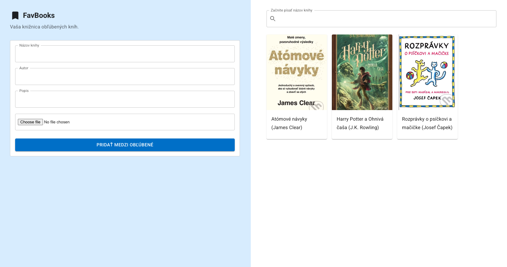

# FavBooks - A Favorite Books Management App

Simple web application to manage favourite books.  Using React, Typescript, Redux (legacy), SASS and React hook form.
It took me around 6 hours to implement the basic features, without spending too much time on design and optimizations.

## Disclaimer & Notes

1. I am not a professional designer. The UI is simple and basic, focusing on the functionality.
2.  I took the basic configuration of eslint and tsconfig from vite `react-ts` boilerplate. In real project I would customize it more to fit my needs. I understand that different teams have different coding standards.
3. I do not have a strong experience with Material-UI, so there is for sure better/different ways how to use it.
4. GitHub Copilot was used to speed up writing comments and commit messages (it tried to be helpful with Material components, but the opposite was true most of the time).
5. I've used some CSS variables somewhere, but then to speedup prototyping I used hardcoded values (e.g. colors, sizing). In real project I would move all those values to variables/theme configuration.

## TODO:

- [x] Implement simple UI (responsive; using sass and components library)
- [x] Implement Redux store to save books (simple data)
- [x] Implement Form to save new book with validations (simple data)
- [x] Add support for image upload
- [x] Implement detail view for book (in modal window)
- [x] Implement search feature
- [x] BONUS - vitest configured and `card-view` module covered by test using AI agent  

## Nice to have (future improvement, features not mentioned in web app description):
- add PostCSS, Autoprefixer
- create theme and move there all hardcoded css variables (e.g. colors, sizing, breakpoints)
- move code from App to "pages" folder if more pages are added
- add tests (Jest, React Testing Library, Playwright)
- migrate to Redux Toolkit
- refactor image upload feature (right now it's stored in Redux and that's NOT optimal). In real app, images should be stored on server.
- add ARIA labels and improve accessibility (e.g. Modal)
- add additional features (e.g. edit book, delete book, pagination/infinite scroll, sort books)
- improve error handling (e.g. error boundary, toast notifications)
- keep only the fonts that are used in the project